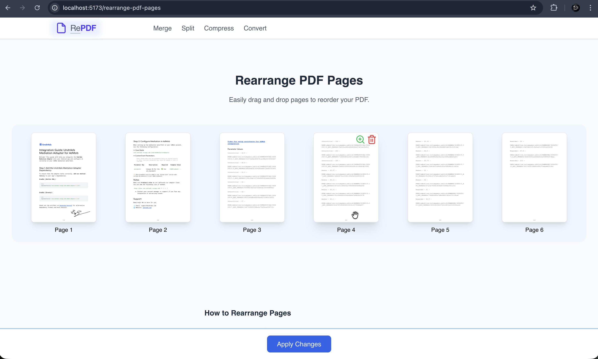

# 📄 RePDF

A modern, browser-based PDF utility suite — no installs.
Users can perform common PDF operations like **compress, convert, lock, unlock, delete pages, rearrange pages, and more**
— all securely on self-hosted backend.

🎥 **Demo Video:**

[](https://youtu.be/x3Yba-QP39o)
[](https://youtu.be/x3Yba-QP39o)

---

## ✅ Current Features

| Tool                | Status | Description                                                   |
| ------------------- | ------ | ------------------------------------------------------------- |
| 🖼️ Images → PDF     | ✅     | Convert multiple images into a single PDF                     |
| 🖼️ PDF → Images     | ✅     | Extract pages of PDF document as images                       |
| 🔀 Delete Pages     | ✅     | Delete Pages from PDF document (confirm page using zoom view) |
| 🔀 Rearrange Pages  | ✅     | Drag-and-drop visual page reordering                          |
| 🔓 Unlock PDF       | ✅     | Remove user password (requires valid password)                |
| 🔒 Lock PDF         | ✅     | Add password protection                                       |
| 📉 Compress PDF     | ✅     | Lossless optimization + optional quality modes (in progress)  |
| ✂️ Split PDF        | ✅     | Extract page ranges into new files                            |
| 🧩 Merge PDFs       | ✅     | Combine multiple PDFs into one                                |
| ✂️ Add Page Numbers | 🔜     | Add page numbers in PDF document                              |

_(✅ Completed · ⏳ In Progress · 🔜 Planned)_

---

## 🚀 Why This Project?

This project was built as a **real-world learning initiative** while preparing for **SDE-II backend roles**.
Instead of a toy app, the goal was to build something **practical and technically meaningful**, covering:

- ✅ Full-stack architecture (React + FastAPI)
- ✅ Modular backend design where each PDF tool works as a standalone API
- ✅ Storage-agnostic file handling (local FS today, **S3-compatible** storage ready for production)
- ✅ Real PDF processing pipelines using PyMuPDF instead of shell hacks
- ✅ Clean separation of backend, frontend, and worker layers for future scaling
- ✅ Docker-friendly deployment path (planned)
- ✅ Good candidate for _resume project that solves a real user pain_

This project focuses on:

- ✅ **Privacy-first**
- ✅ **Fast & simple UX**
- ✅ **Open source**
- ✅ **Modular design** (each tool works as standalone or inside the full suite)

---

## 🧱 Project Structure

```bash
re-pdf/
│
├── backend/   # FastAPI (Python) – PDF processing endpoints
├── frontend/  # React (TypeScript) – UI, drag & drop tools
```

Each sub-folder (`backend/`, `frontend/`) contains a dedicated README for setup & development.

---

## 🛠️ Tech Stack

| Area     | Tech                                      |
| -------- | ----------------------------------------- |
| Frontend | React + TypeScript + Tailwind, pdfjs-dist |
| Backend  | FastAPI, PyMuPDF, Ghostscript             |

---

## 🧪 How to Run Locally (Dev Mode)

> Full setup instructions are in `/backend/README.md` and `/frontend/README.md`

#

👤 **Author**

Sanjay Tanwar – Backend & Full-Stack Engineer <br>
🔗 [LinkedIn](https://www.linkedin.com/in/sayraj/) <br>
📧 sayraj1771@gmail.com <br>

---
